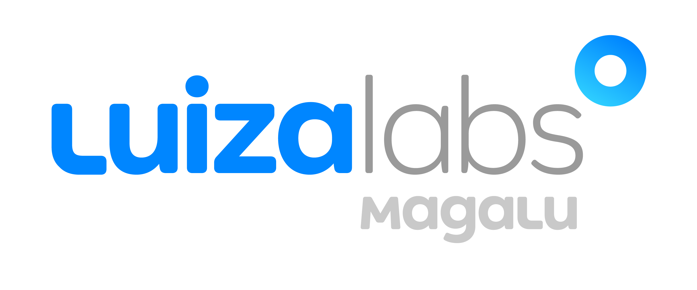

<h1 align="center">
    
</h1>

# Projeto API - Vertical Logística


## Preconditions

- Python 3

## Clone do projeto

```
git clone  https://github.com/fernandocarvalhaes007/ApiLogistica

```


## Objetivos

```
[ x ] - Criar servidor Python com o Flask
[ x ] - Criar rota de upload de arquivo POST
[ ] - Criar classe de entidade com os seguites atributos:

|-----------------------------------------------------------|     
| Campo             | Tamanho | Tipo                        |
|-------------------|---------|-----------------------------|
| user_id           | 10      | numérico                    |
| name              | 45      | texto                       |
| product_id        | 10      | numérico                    |
| id_produto        | 10      | numérico                    |
| valor_do_produto  | 12      | decimal                     |
| data_compra       | 8       | numérico  (format yyyymmdd) |
|-----------------------------------------------------------|   

[ ] - Adcionar a lógica de leitura de arquivo
[ ] - Serilializar os dados em JSON e retornar na chamada

```

## Arquivos necessários

```
pip install -r requirements.txt

```

## Endpoint

```
Endpoint arquivo data_1.txt -> http://127.0.0.1:5000/upload_data1

Endpoint arquivo data_2.txt -> http://127.0.0.1:5000/upload_data2

```

## Retorno esperado da API 

```
[
	{
		"user_id": 70,
		"name": "Palmer Prosacco",
		"orders": [
			{
				"order_id": 753,
				"total": "R$ 4252,53",
				"date": "08/03/2021",
				"products": [
					{
						"product_id": 3,
						"value_sum": "R$ 3633,74"
					},
					{
						"product_id": 4,
						"value_sum": "R$ 618,79"
					}

				]

		    }

        ]

    {
]

```


